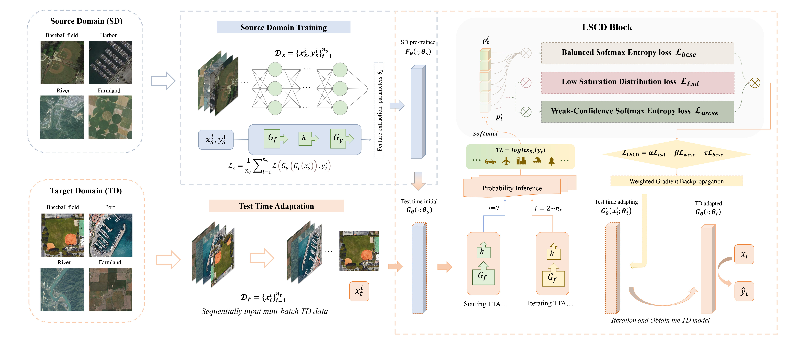

# LSCD-TTA

✅ (2025-03-04) Our Work is accepted by *The International Journal of Applied Earth Observation and Geoinformation*

Thanks for the main code architecture offered by [DomainAdaptor](https://github.com/koncle/DomainAdaptor).

In this work, we designed a TTA method, LCCD-TTA, tailored for cross-domain remote sensing image classification tasks. Additionally, we compare the core loss designs of advanced DA and TTA methods in the test-time adaptation process.

For further details, please refer to our paper:

[Low Saturation Confidence Distribution-based Test-Time Adaptation for Cross-Domain Remote Sensing Image Classification](https://arxiv.org/abs/2408.16265)




## Install packages
Our main project developed on Pytorch. 
Please refer to [Pytorch official](https://pytorch.org/) for suitable releases for your own GPU environment.

```bash
pip install torch torchvision torchaudio
pip install matplotlib tqdm tensorboardX
```

## Sampled Dataset structure
Since the corresponding categories in different domain datasets sometimes correspond to different labels, you need to align the same categories in different datasets sequentially in advance.

For example, you can assign your data follow our proposed structure in `data/DataSets/`:
```
a2n
├── aid
│   ├── 00 (airport)
│   ├── 01 (baseballfield)
│   ├── 02 (commercial)
│   └── ...
├── nwpu
│   ├── 00 (airport)
│   ├── 01 (baseball_diamond)
│   ├── 02 (commercial_area)
```

The data root can be modified in [main.py](main.py) or pase the args `--data-root your_data_root`.

After the data is organized, you can generate the text list for the training and validation set by running the following code:

```bash
python dataloader/text_list_generator.py
```


## Run the code
You can train the source models by yourself to obtain the pretrained source models with the following code:

```bash
bash script/deepall.sh
```

With the pretrained models, you can run the following code to evaluate with TTA framework in the simplest form:

```bash
bash script/TTA.sh
```

for our proposed LSCD-TTA, you can run the following code instead for better adaptation in cross-domain remote sensing image classification tasks:

```bash
bash script/LSCD_TTA.sh
```

## Citation

```
@article{liang2025low,
  title={Low Saturation Confidence Distribution-based Test-Time Adaptation for cross-domain remote sensing image classification},
  author={Liang, Yu and Cao, Shilei and Zheng, Juepeng and Zhang, Xiucheng and Huang, Jianxi and Fu, Haohuan},
  journal={International Journal of Applied Earth Observation and Geoinformation},
  volume={139},
  pages={104463},
  year={2025},
  publisher={Elsevier}
}
```

